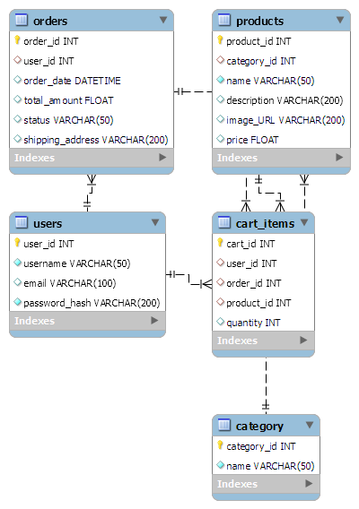

# QA_Store

Welcome to the project documentation for QA_Store, an online plant store web application. This document outlines the development journey, challenges, and achievements of building an e-commerce platform using technologies like Python, Flask, HTML, CSS, SQL, and Jenkins. The goal was to create a functional store where users can browse products, add them to the cart, make purchases, and more

Technologies used: Python, Flask, CSS, HTML, Jenkins, SQL, GIT and GitHub.
### Contents

[Identifying Epics and Tasks](#identifying-epics-and-tasks)

[Functionality of Site](#functionality-of-site)

[Database Creation](#database-creation)

[Front End Development](#front-end-development)

[Backend Development](#backend-developmet)

[Jenkins](#jenkins)

[Problems](#risks-and-difficulties)

[Future Ideas and Improvements](#furture-ideas-and-improvements)

---

## Identifying Epics and tasks

Using an Agile methodology, the project's requirements were dissected into user stories and grouped into epics. These epics categorized user stories for store administrators, customers, and visitors. The project used a Kanban board in Jira to manage tasks and maintain a structured development process.

<a href = "/documentation/user_stories.md"> Click here to see the user stories and epics </a>

Here are a few screenshot of the board:

---
## Functionality of site
Here is a demonstration of the webpage that I was able to create by the deadline

<a href = "/documentation/final.mp4"> Webpage Demo</a>

Below is screenshots of each page, the homepage had the most documentation of development as it was also styling the header and footer.
The screenshots for all of them can be found <a href = "/documentation/screenshots/Homepage_Dev">Here</a>.

### Homepage

### About

### Contact Us

### Login

### Register

### Products

### Cart

### Checkout

### Payment

Payment Success:

---
## Database creation

To be able to manage the products for the store and create a functioning cart system and categories page a database using MySQL was used. Here I created three tables for storing and managing the data, these were the product table, category table and cart_items table.

The product table has the following attributes:
- product_id (int,Primary key)
- category_id (int, foreign key to the category table)
- name (VAR_CHAR(50))
- description (VAR_CHAR(200))
- price (float)
- image_URL (VAR_CHAR(200))

The category table has the following attributes:
- category_id (int, foreign key to the category table)
- name (VAR_CHAR(50))

The cart_items table has the following attributes:
- cart_id (int,Primary key)
- user_id (int, foreign key to the user table)
- order_id (int, foreign key to the order table)
- product_id (int, foreign key to the product table)
- quantity (int)

In addition to these a user table and an orders table will also be created so orders placed after payment can be accessed by customers using their username and password, this would also mean creating a registration form for customers.

The users table will have the following attributes:

- user_id (int, primary key)
- username (varchar(50))
- email (varchar(100))
- password_hash (varchar(200))

    The hashed password is used for security purposes.

The orders table has the following attributes:

- order_id (int, primary key)
- user_id (int, foreign key referencing users table)
- order_date (DATETIME)
- total_amount (float)
- status (varchar(50)) this will have status of either processing, shipped or delivered
- shipping address (varchar(200))

You can see the SQL query for creating these tables <a href = "/documentation/SQL_Files/table_creation.sql">here</a>
<h3 align="center"> Entity Relationships Diagram </h3>

I had originally created the tables in the database using SQL querying but found it difficult to connect the tables to the flask application, upon research and going back over training I found it would be easier to remove the tables from the database and to recreate them using classes in the app file.

Also created a create file to manage the database creation, the create file is <a href = "create.py">here</a>.

---
## Front End Development

For the front end development I made templates for the html files and a styling sheet to keep the styling consistent throughout the website, and extended from a base html to keep a header and footer on the webpage.

These files are stored <a href = "/templates/">here</a>, in the templates folder and linked to the CSS stylesheet and images in the static folder.

I did have issues trying to get the products to line up next to each other on the product page using flex positioning and wrapping, I managed to achieve this with three test products but when I added over three the products overflowed to column wrapping.

Test Products:

Final Product Page:

---
## Backend Development

The back-end development faced challenges, particularly in implementing functions for adding items to the cart. I was able to create tables and add data to them using the create.py file but I was struggling to find a way within the deadline to implement the function of transferring product data to the cart table and then the cart table data to the orders table after successful payment validation.
I also had trouble creating the category page, I knew I had to query the category table and get the category id and then filter the products in the product table by the category_id but was unable to implement that in time.

A transition was made from using HTML forms to Flask forms as I accidentally used botha nd was causing the payment system to skip form validation, due to time constraints the login and register forms were not fully integrated into this format.

---
## Jenkins

Jenkins was employed to automate build processes and test deployments. The Jenkins pipeline facilitated continuous integration and deployment, ensuring consistent application builds. I did encounter an error when trying to connect to MySQL when using the pymysql connection so I amended the jenkins build script to use the sqlite connection.

This is my jenkins shell commands:

This is the successful build of the application:

---
## Tests

A test folder was set up with a test file to assess webpage responsiveness, but pytest has yet to be executed on them.

---
## Risks and Difficulties

Several challenges were encountered during the project:

- Issues with linking the database to Jenkins and the subsequent adjustments needed to ensure successful builds.

- Difficulty managing time, with some tasks taking longer than anticipated.

- Challenges with cart management and the overall process of adding products to a cart and completing an order with payment.

- Time management was a problem as I under estimated how long some task s would take and the problems I faced with back end development.

---
## Future ideas and improvements

I initially started this project with the intentions of implementing a login system as that was the only theological wa I could see getting the order history for individual customers to work. This is a function I think should still be implemented as the tables in the database use the user_id obtained from the users table to track items in carts as well as order history allowing for customers to come back to carts even if they log out.

Next time I work on a project like this I would prioritise back end development more as that is more crucial for a viable product then a pretty looking webpage with no function.

I can also see how much easier this project would have been if working in a team and using Jira and an agile method to complete sprints, this would allow for smoother and speedier development with collaboration on more difficult aspects of the project.

Future enhancements and improvements include:

- Implementing user login for personalized experiences.
- Focusing on robust back-end development for functional features.
- Collaborative development using agile methods and team-based contributions.
- Exploring webhook integration for automated testing.

---
[Back to the top](#qa_store)